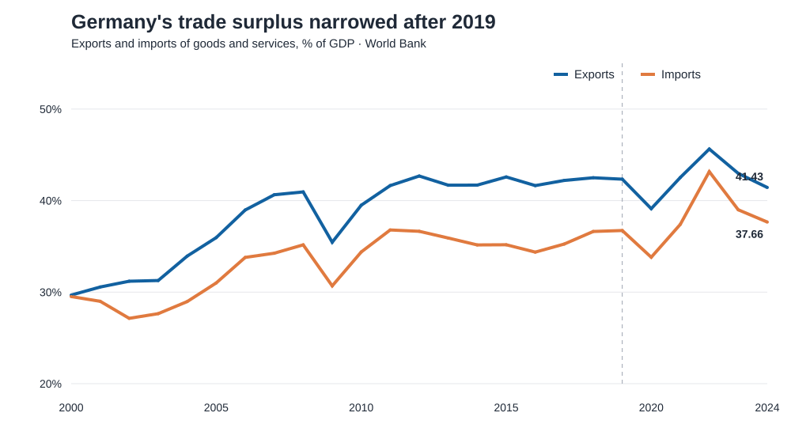
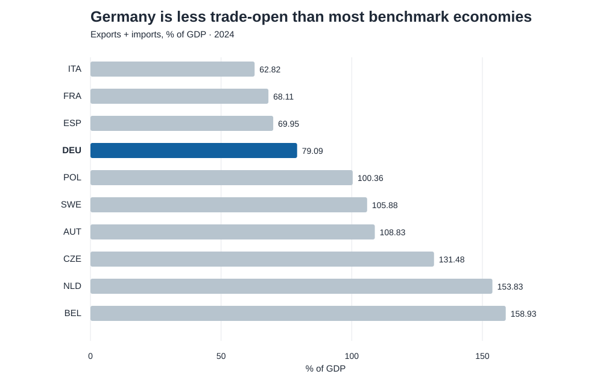
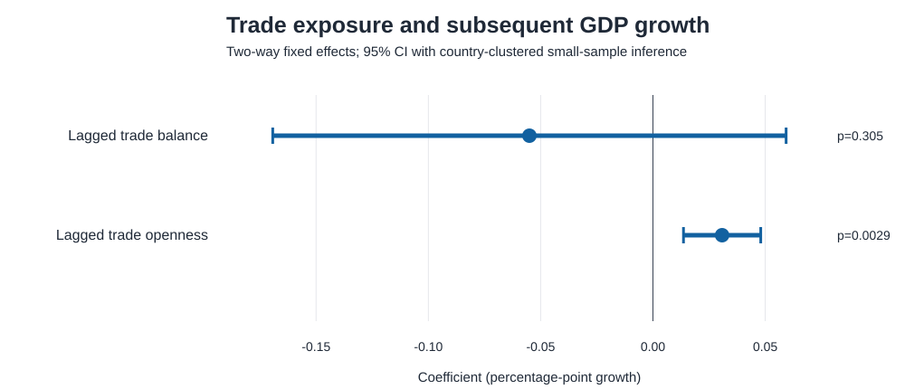

# Germany Trade Exposure & Resilience

[](https://github.com/ermanesen/germany-trade-analysis/actions/workflows/tests.yml)
[](https://www.python.org/)
[](LICENSE)

Germany's external position benchmarked against nine major EU economies from 2000 to 2024. The project separates **trade exposure**, **trade position**, and **growth outcomes** instead of presenting an accounting identity as an econometric result.



## The decision question

Is Germany's recent weakness best understood as lower trade integration, an erosion of its external surplus, or a broader growth problem—and does a larger trade surplus predict stronger subsequent growth?

## What the data say

- Germany's trade surplus narrowed from **5.61% of GDP in 2019 to 3.78% in 2024** (−1.83 percentage points).
- Total openness barely moved—**79.07% to 79.09% of GDP**—while export-import coverage fell from **115.26% to 110.03%**.
- In 2024 Germany ranked **5th of 10** by trade balance, **7th** by openness, and **9th** by real GDP growth.
- Germany's 2024 openness was below the peer median (**79.09% versus 105.88%**), while its balance was above it (**3.78% versus 2.74%**).
- A two-way fixed-effects model finds no precise association between the prior year's trade balance and growth: **β = −0.055, SE = 0.051, p = 0.305**.
- Lagged openness is positively associated with growth (**β = 0.031, SE = 0.008, p = 0.0029**), but the design is observational and not causal.



## Why the original regression was removed

Regressing `Trade Balance = Exports − Imports` on exports and imports is a tautology. It must return coefficients near +1 and −1 with an R² near 1 because the dependent variable was constructed from the regressors. Here, the balance remains a descriptive accounting measure. The model instead explains annual real GDP growth using one-year-lagged balance and openness, country and year fixed effects, and country-clustered standard errors with small-cluster t inference.



## Data and scope

The committed snapshot contains **250 complete observations**: Germany, Austria, Belgium, Czechia, France, Italy, the Netherlands, Poland, Spain, and Sweden over 2000–2024.

Source: World Bank World Development Indicators:

- [Exports of goods and services (% of GDP)](https://data.worldbank.org/indicator/NE.EXP.GNFS.ZS)
- [Imports of goods and services (% of GDP)](https://data.worldbank.org/indicator/NE.IMP.GNFS.ZS)
- [GDP growth (annual %)](https://data.worldbank.org/indicator/NY.GDP.MKTP.KD.ZG)

The pipeline constructs the full expected country-year grid before merging and fails if a value is missing or duplicated. Raw downloads are excluded from version control; the compact validated panel is committed for reproducibility.

## Reproduce

```bash
python -m venv .venv
# Windows: .venv\Scripts\activate
# macOS/Linux: source .venv/bin/activate
pip install -e . -r requirements.txt
python scripts/run_analysis.py
pytest -q
```

Use `python scripts/run_analysis.py --refresh` to download the indicators again from the World Bank API. Continuous integration repeats the tests, pipeline, and notebook execution on every push and pull request.

## Repository structure

```text
config/                  countries, years, and indicator codes
data/processed/          validated 250-row analytical snapshot
figures/                 publication-ready charts
notebooks/analysis.ipynb documented, executed analytical walkthrough
reports/                 report and exported model tables
scripts/                 one-command pipeline entry point
src/germany_trade/       download, validation, analysis, visualization
tests/                   data, model, notebook, and artifact checks
```

## Interpretation limits

This is an associative macro-panel benchmark, not a causal estimate. Ten country clusters limit precision. The indicators aggregate goods and services and do not measure bilateral partners, sectors, exchange rates, energy prices, or supply-chain concentration. See the [full report](reports/final_report.md) for the interpretation and limitations.

## License

Code is released under the [MIT License](LICENSE). World Bank indicator data are used under the source's [CC BY 4.0 terms](https://www.worldbank.org/en/about/legal/terms-of-use-for-datasets).
